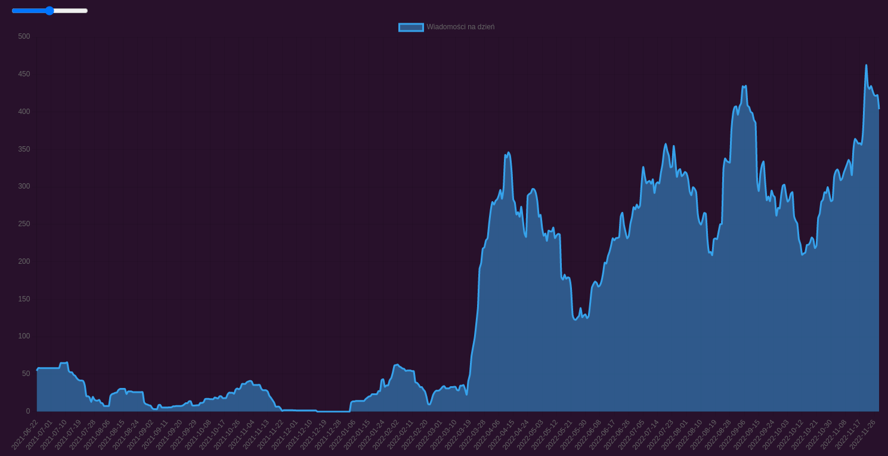
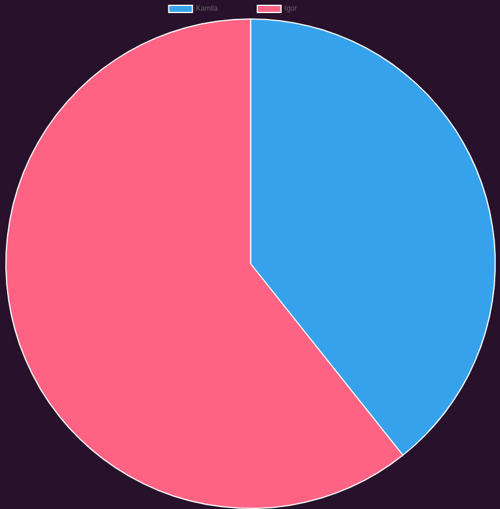

# Strona pozwalająca zobaczyć statystyki rozmów na messengerze

### Frontend: **React**
### Backend: **Django** (MariaDB)

## Pokazywane statystyki:
- Średnia ilość wiadomości na dzień

- Stosunek wiadomości wysłanych do odebranych

## Planowane funkcje:
- Porównywanie konwersacji
- Więcej statystyk
  - Wysłane zdjęcia
  - Reakcje na wiadomości
- Większa funkcjonalność interfejsu

## Cechy:
- Backend pozwalający na wiele kont posiadających oddzielne statystyki
- Wczytywanie wielu konwersacji na raz z folderu